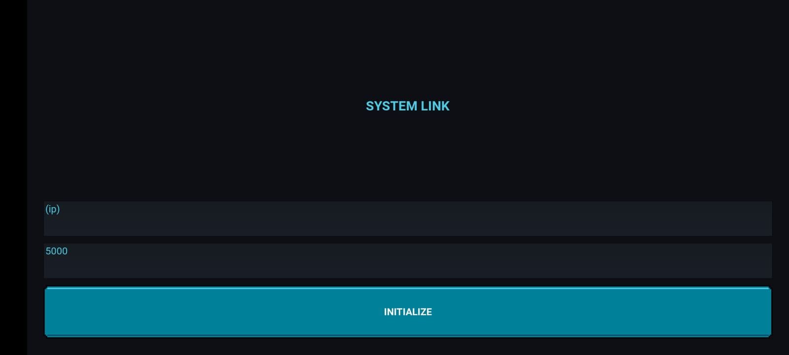
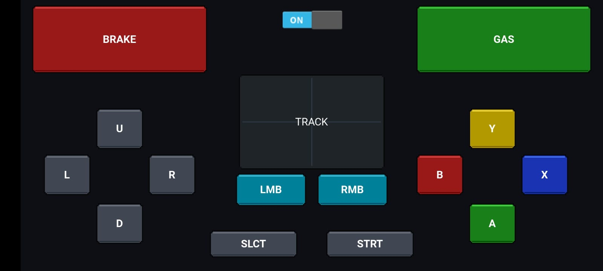

# 🏎️ Overdrive Wheel

**Overdrive Wheel** is a custom, retro-cyberpunk-themed Android gamepad and steering wheel built with Python and the Kivy framework. It turns your Android phone into a fully functional PC controller, streaming gyroscope steering data, touchpad movements, and button inputs over a local Wi-Fi network via ultra-fast UDP.

## ✨ Features

* **🏎️ Gyroscopic Steering:** Uses your phone's built-in accelerometer to calculate tilt and send real-time steering data.
* **🖱️ Virtual Trackpad:** Includes a retro-grid touch area to control the PC mouse cursor.
* **🕹️ Full Gamepad Layout:** Features a classic layout including D-Pad, A/B/X/Y, Start/Select, Left/Right Bumpers (Gas/Brake), and Mouse Clicks.
* **⚡ Zero-Latency UDP:** Sends lightweight, string-based UDP packets over your local network for near-instantaneous response times.
* **🎨 Synthwave UI:** Custom-drawn pseudo-3D buttons with a translucent neon aesthetic—all rendered purely in Kivy canvas without the need for external image assets.

---

## 📸 Screenshots

*(Replace these placeholders with actual screenshots of your app!)*
| Login Screen | Controller Screen |
|:---:|:---:|
|  |  |

---

## 🛠️ Prerequisites

To compile this project into an Android APK, you will need:
* **Python 3.8+**
* **Kivy** (`pip install kivy`)
* **Buildozer** (For packaging the APK on a Linux/WSL environment)

---

## 🚀 Building the APK

This project uses Buildozer to compile the Python code into an installable Android APK.

1. Clone the repository:
   ```bash
   git clone [https://github.com/yourusername/overdrive-wheel.git](https://github.com/yourusername/overdrive-wheel.git)
   cd overdrive-wheel
